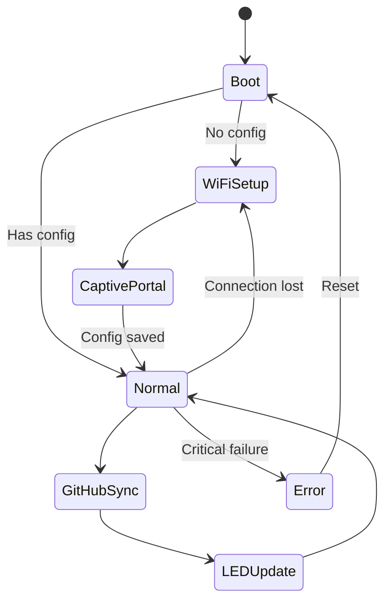
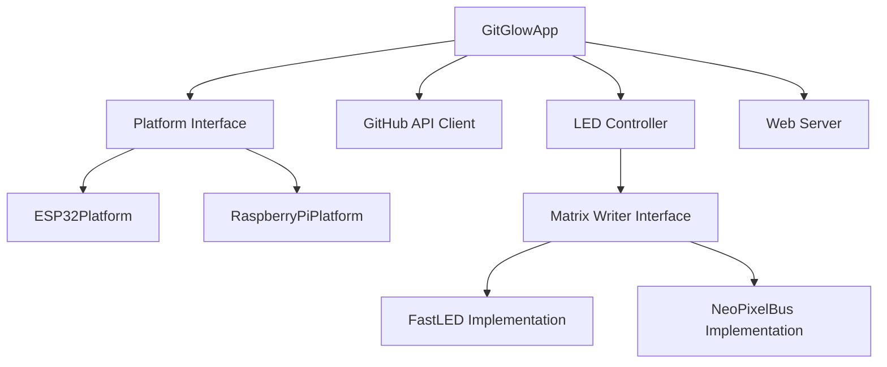

# GitGlow Architecture

## Main Application State Machine

```mermaid
stateDiagram-v2
    [*] --> Boot
    Boot --> WiFiSetup : No config
    Boot --> Normal : Has config
    
    WiFiSetup --> CaptivePortal
    CaptivePortal --> Normal : Config saved
    
    Normal --> GitHubSync
    GitHubSync --> LEDUpdate
    LEDUpdate --> Normal
    
    Normal --> WiFiSetup : Connection lost
    Normal --> Error : Critical failure
    
    Error --> Boot : Reset
```

## Component Overview

```mermaid
graph TD
    A[GitGlowApp] --> B[Platform Interface]
    A --> C[GitHub API Client]
    A --> D[LED Controller]
    A --> E[Web Server]
    
    B --> F[ESP32Platform]
    B --> G[RaspberryPiPlatform]
    
    D --> H[Matrix Writer Interface]
    H --> I[FastLED Implementation]
    H --> J[NeoPixelBus Implementation]
```

This file demonstrates Mermaid diagrams that should render automatically in VS Code and GitHub!